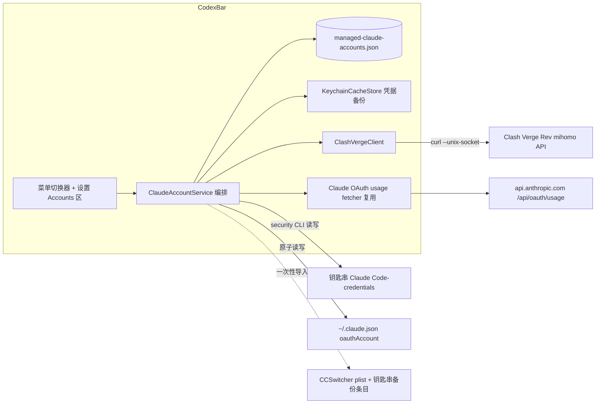
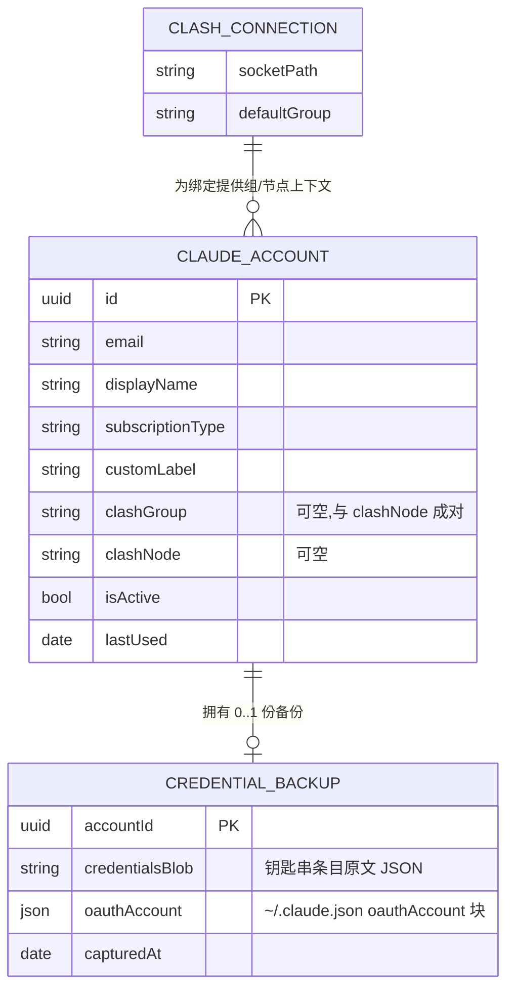
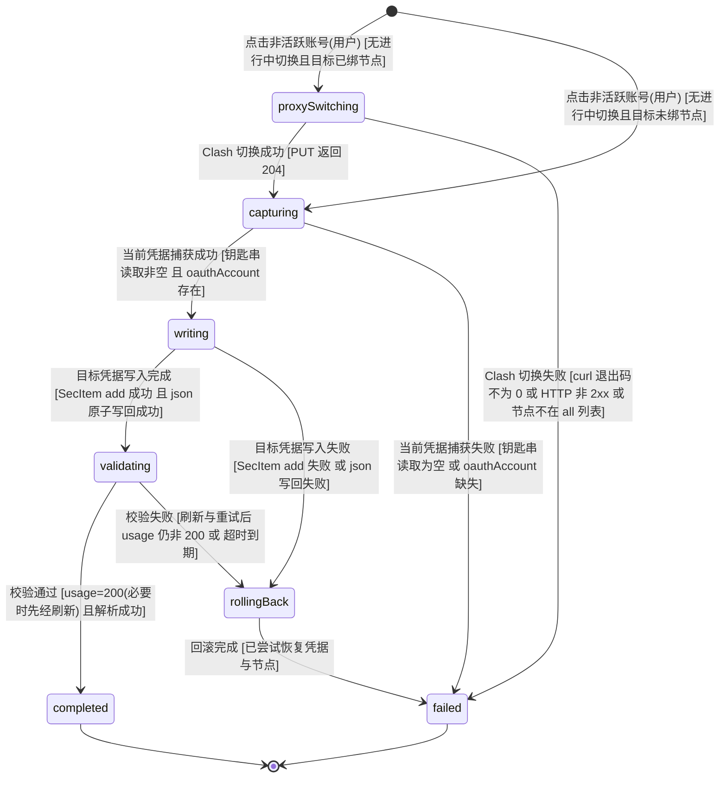
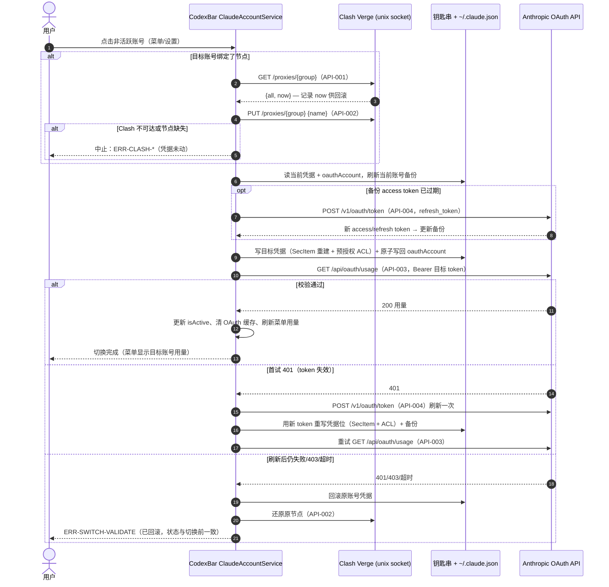
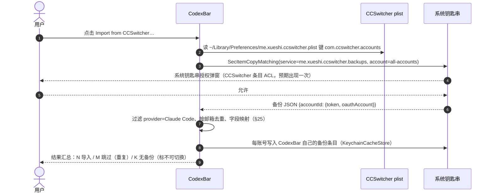
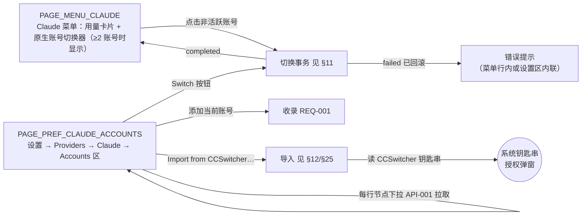

# Claude 原生多账号 + Clash 代理联动 设计文档

## 1. 元信息 / 变更记录

| 字段 | 值 |
| --- | --- |
| 状态 | 已批准 |
| 项目画像 | 个人工具（单人使用与维护，无运营无值守；核心节伸缩按此档） |
| Owner | Bearisbug |
| 评审人 | Bearisbug |
| 最后更新 | 2026-07-17 |
| 关联 | 仓库 `Bearisbug/CodexBar`（fork）· 参照实现 `~/Documents/Git/CCSwitcher` · 本文档取代并删除 `docs/claude-multi-account-and-status-items.md`（上游 claude-swap 方案文档，其中 claude-swap 适配器行为描述仍以 `docs/claude.md` 为准） |

变更记录：

| 日期 | 版本 | 改动 | 作者 |
| --- | --- | --- | --- |
| 2026-07-17 | v0.1 | 初稿 | Bearisbug |
| 2026-07-17 | v1.0 | 用户确认，状态转已批准 | Bearisbug |
| 2026-07-17 | v1.1 | §9 容错策略简化：单写者文件不做未知字段保留，改为 version 守卫（实现期修正） | Bearisbug |
| 2026-07-17 | v1.2 | §13 菜单切换器形态修正：原生 NSMenu 行替代复用 segmented/stacked 自绘控件（复用成本不成比例） | Bearisbug |
| 2026-07-17 | v1.3 | §23 上线前检查单登记首轮结果（自动化项过，人工项待执行） | Bearisbug |
| 2026-07-17 | v1.4 | 实测缺陷修正：备份 access token 过期导致切换校验 401 误判回滚（CCSwitcher 导入件必现）。新增 API-004 token 刷新，切换事务在过期/401 时先刷新并重写凭据位与备份（§8/§11/§12/§14/§17/§19） | Bearisbug |
| 2026-07-17 | v1.5 | 实测缺陷修正：security CLI delete+add 重建条目清空 ACL，「始终允许」失效导致每次切换弹钥匙串授权。ADR-004 修订为 SecItem 重建 + 预授权 ACL（信任 CodexBar 与 /usr/bin/security），切换零弹窗（§11/§12/ADR-004） | Bearisbug |

## 2. 背景 / 目标 / 非目标

- 背景：用户有 4 个 Claude Max 订阅账号轮换使用，每个账号绑定一个 Clash Verge Rev 出口节点（避免多账号同 IP 登录）。现状是两个 app 分工：CodexBar 看用量、CCSwitcher 切账号+切代理。CodexBar 自身没有原生 Claude 多账号能力——仅有依赖外部 `cswap` CLI 的 opt-in 适配器（未安装则无多账号面板）。
- 目标：把 CCSwitcher 的「多账号凭据交换 + Clash 节点联动」能力原生并入 CodexBar，一个 app 完成看量、切号、切代理；并把 CCSwitcher 已有的 4 个账号（元数据 + 凭据备份 + 节点绑定）一键无缝导入。
- 非目标（明确不做）：
  - 按额度自动切号（只做用户显式点击切换）；
  - Codex 及其他 provider 的代理绑定（本期只做 Claude）；
  - Clash 之外的代理软件（Surge/sing-box 等）与 HTTP external-controller 接入方式；
  - 管理 Clash 配置本身（订阅、规则、组定义——只做「组内选节点」）；
  - per-account 菜单栏图标（上游 Phase 2 概念，不做）；
  - app 内发起新账号 OAuth 登录（新账号靠 `claude /login` 后「添加当前账号」收录）；
  - 与 CCSwitcher 双向同步（导入是一次性读取，之后两 app 数据各自独立）；
  - `codexbar` CLI 子命令支持（本功能仅菜单栏 app）。

规模画像：

| 维度 | 估算 | 依据 / 假设 |
| --- | --- | --- |
| 用户量 | 1（本人，单机 macOS） | 个人 fork 功能 |
| 请求量 | 切换 ≤20 次/天；Clash API 仅切换与打开设置时按需调用，不轮询 | 使用习惯；超过此量级无需重估（本地调用） |
| 数据量 | 账号 ≤10，凭据备份每条 ≤4 KB | 现有 4 账号；超过 10 个需重估列表 UI |
| 分布与形态 | 单机、本地 unix socket 与本机文件，仅校验步骤出公网 | 菜单栏 app |

## 3. 成功指标 / 验收阈值

N/A — 画像:个人工具，无埋点与指标体系；「做完」以 §19 验收用例全数通过为准。

## 4. 术语表 / 统一语言

| 术语 | 定义 | 代码/字段标识 | 对应实体 |
| --- | --- | --- | --- |
| 原生账号 | CodexBar 自管的 Claude 订阅账号条目（区别于 claude-swap 账号、Token 账号） | `ClaudeManagedAccount` | `ENT-ClaudeAccount` |
| 凭据备份 | 某账号的系统凭据快照：钥匙串 `Claude Code-credentials` 原文 + `~/.claude.json` 的 `oauthAccount` 块 | `ClaudeCredentialBackup` | `ENT-CredentialBackup` |
| 活跃账号 | 当前占据系统凭据位（钥匙串条目 + oauthAccount）的账号，全列表唯一 | `isActive` | `ENT-ClaudeAccount` |
| 收录 | 把当前系统凭据捕获为某账号的凭据备份 | `capture` | — |
| 切换 | 把系统凭据位从当前账号交换为目标账号（含可选代理联动、校验、回滚） | `switch` | — |
| Clash 绑定 | 账号关联的「代理组 + 节点」，可为空（空 = 切号不动代理） | `clashGroup` / `clashNode` | `ENT-ClaudeAccount` |
| Clash 连接 | app 级 Clash Verge 接入配置：unix socket 路径 + 默认代理组 | `ClashConnectionSettings` | `ENT-ClashConnection` |
| 导入 | 从 CCSwitcher 的 plist 与钥匙串备份读取账号并转存为原生账号的一次性迁移 | `import` | — |

## 5. 功能清单与需求 ID

| ID | 功能 | 锚点 | 优先级 |
| --- | --- | --- | --- |
| REQ-001 | 收录：设置面板「添加当前账号」把当前系统凭据存为原生账号（含备份）；已存在同邮箱账号则刷新其备份 | 无对外 API，见 §13 PAGE_PREF「添加当前账号」边 + §19 | P0 |
| REQ-002 | 切换：点击非活跃账号→（可选代理联动）→凭据交换→校验→失败自动回滚 | 状态机 §11 全部迁移行 + `API-003` | P0 |
| REQ-003 | 绑定管理：每账号可绑定/解绑一个 Clash「组+节点」，节点列表从 Clash 实时拉取 | `API-001` + §13 PAGE_PREF | P0 |
| REQ-004 | 代理联动：目标账号有绑定时先切 Clash 节点，Clash 失败则中止且凭据不动；校验失败回滚时还原原账号节点 | 状态机 §11 `[*]→proxySwitching`、`rollingBack→failed` 行 + `API-002` | P0 |
| REQ-005 | CCSwitcher 一键导入：读元数据与凭据备份，过滤 Claude 账号、按邮箱幂等去重、保留节点绑定 | §25 迁移映射 + §12 时序-导入 | P0 |
| REQ-006 | 菜单账号切换器：原生账号 ≥2 时 Claude 菜单显示切换器（复用现有多账号布局），点击非活跃账号触发切换 | §13 PAGE_MENU | P1 |
| REQ-007 | 设置 Accounts 区：账号列表（别名/邮箱/订阅/活跃标记）、改别名、删账号、Clash 连接配置与状态行 | §13 PAGE_PREF | P1 |
| REQ-008 | 隐私与安全：凭据只存钥匙串；日志不含 token 与邮箱（账号以 UUID 指代）；邮箱展示遵循 Hide Personal Info | §19 场景 + §9 PII 列 | P0 |

## 6. 总体架构



- 新增模块全部挂在 `ClaudeAccountService`（app 层编排）之下；用量抓取、菜单渲染、设置窗口沿用现有骨架。
- 与「依赖与外部系统」（§17）一一对应：Clash Verge、钥匙串、`~/.claude.json`、Anthropic usage 端点、CCSwitcher 数据（仅导入时读）。

## 7. 数据模型 / 领域实体



- `ENT-ClaudeAccount`：账号元数据。持久化在 `~/Library/Application Support/CodexBar/managed-claude-accounts.json`（照 Codex 托管账号先例，独立于 `config.json`，见 ADR-006）。`isActive` 全列表至多一个为 true。
- `ENT-CredentialBackup`：凭据备份。只存 macOS 钥匙串（`KeychainCacheStore`，category `claude-account-backup`，identifier = 账号 UUID，每账号一条）。`credentialsBlob` 必须含 `claudeAiOauth` 键（Claude Code 2.1.x 可能出现仅 `mcpOAuth` 的条目，收录时拒绝，见 §14 `ERR-CAPTURE-INVALID`）。元数据存在而备份缺失的账号视为「不可切换」，UI 提示先收录。
- `ENT-ClashConnection`：app 级 Clash 连接配置，与账号列表同文件存储（顶层 `clash` 对象）。

## 8. 接口契约 (API-first)

本功能不对外暴露任何接口，仅消费三个外部端点。内部操作（收录/导入/删除）锚定在 §11 状态机与 §12 时序，不设 API ID。

- **`API-001` clashGroupStatus** — 实现 `REQ-003`、`REQ-004` 的前置查询
  - 方法/路径：`GET http://localhost/proxies/{group}`，经 `curl --unix-socket <socketPath>` 发出（见 ADR-002）；`{group}` 需 URL 编码
  - 请求：无 body
  - 响应 200：`{"all": ["节点名", …], "now": "当前节点", "type": "Selector", …}`；本功能只读 `all` 与 `now`
  - 错误：curl 退出码 ≠0（socket 不存在/连接拒绝）→ `ERR-CLASH-UNREACHABLE`；HTTP 404 → `ERR-CLASH-GROUP-MISSING`
  - 缓存与超时：不缓存（每次实时查询）；超时 3s；不自动重试（用户可手动刷新）
- **`API-002` clashSwitchNode** — 实现 `REQ-004`
  - 方法/路径：`PUT http://localhost/proxies/{group}`，body `{"name": "<节点名>"}`，同样经 unix socket
  - 响应 204：切换成功；HTTP 400/404 → `ERR-CLASH-NODE-MISSING`
  - 幂等：是（重复设置同一节点无副作用）；超时 3s；不自动重试
- **`API-003` claudeOAuthUsage（复用现有 fetcher）** — 实现 `REQ-002` 的切换后校验
  - 方法/路径：`GET https://api.anthropic.com/api/oauth/usage`
  - 请求头：`Authorization: Bearer <目标账号 accessToken>`、`anthropic-beta: oauth-2025-04-20`（与现有 Claude OAuth 抓取完全一致，复用其实现与解析）
  - 响应 200 → 校验通过并顺带得到首屏用量；401 → 先走 `API-004` 刷新一次再重试；刷新后仍失败/403/超时 → 校验失败，触发回滚（见 §11）
  - 超时 10s；不自动重试（401 触发的一次刷新重试除外）
- **`API-004` claudeOAuthTokenRefresh** — 实现 `REQ-002` 的备份保鲜（备份中的 access token 常已过期——CCSwitcher 导入件与久置备份必然如此；access token 数小时即失效，可用性以 refresh token 为准，与 Claude CLI 自身的续期机制同源）
  - 方法/路径：`POST https://platform.claude.com/v1/oauth/token`，body `grant_type=refresh_token&refresh_token=<token>&client_id=<现有 oauthClientID>`（复用 `ClaudeOAuthCredentialsStore` 的端点与 client_id 常量；不经其缓存/退避门，无副作用）
  - 触发时机：切换事务写入目标凭据前发现 `expiresAt` 已过期，或 `API-003` 返回 401 时各刷新一次
  - 响应 200：`{access_token, refresh_token?, expires_in}` → 用新 token 重写系统凭据位与该账号备份（refresh token 轮转后旧值失效，必须同步持久化）
  - 失败（invalid_grant 等）→ 该账号需重新登录收录，切换回滚
  - 超时 30s；不自动重试

> **演进与弃用**：本功能自身无对外契约。消费的外部接口中，mihomo `/proxies` 是 Clash 系稳定 API（CCSwitcher 长期使用验证）；`/api/oauth/usage` 是 CodexBar 既有依赖，其变更风险由现有 Claude provider 统一承担。版本方案/弃用期：N/A。

## 9. 数据字典

| 字段 | 存储名 | 类型 | 必填 | 枚举/约束 | 存放位置 | PII |
| --- | --- | --- | --- | --- | --- | --- |
| 账号 ID | `id` | uuid | 是 | 导入时复用 CCSwitcher 原 UUID（见 §25） | managed-claude-accounts.json | 否 |
| 邮箱 | `email` | string | 是 | 去重键（大小写不敏感） | 同上 | **是**（展示遵循 Hide Personal Info；禁止入日志） |
| 显示名 | `displayName` | string | 否 | — | 同上 | 是（同邮箱处理） |
| 订阅类型 | `subscriptionType` | string | 否 | 自由文本（`max`/`pro`/…），仅展示 | 同上 | 否 |
| 别名 | `customLabel` | string | 否 | 展示时优先于邮箱 | 同上 | 否 |
| Clash 组 | `clashGroup` | string | 否 | 与 `clashNode` 同生同灭 | 同上 | 否 |
| Clash 节点 | `clashNode` | string | 否 | 须存在于组的 `all` 列表（切换时校验） | 同上 | 否 |
| 活跃标记 | `isActive` | bool | 是 | 全列表至多一个 true | 同上 | 否 |
| 最近使用 | `lastUsed` | date | 否 | 切换成功时更新 | 同上 | 否 |
| 凭据原文 | `credentialsBlob` | string | 是（备份内） | 必须含 `claudeAiOauth` 键 | 钥匙串（KeychainCacheStore） | **是** |
| 身份块 | `oauthAccount` | json | 是（备份内） | 原样保存/写回，不改造字段 | 钥匙串（同上） | **是** |
| 捕获时间 | `capturedAt` | date | 是（备份内） | 每次收录/切换前刷新 | 钥匙串（同上） | 否 |
| socket 路径 | `clash.socketPath` | string | 是 | 默认 `/tmp/verge/verge-mihomo.sock` | managed-claude-accounts.json | 否 |
| 默认代理组 | `clash.defaultGroup` | string | 是 | 默认 `GLOBAL`；账号未指定组时用它 | 同上 | 否 |

客户端容错：`managed-claude-accounts.json` 由 CodexBar 单写者持有，以 `version` 字段守卫——高于当前版本时拒绝加载并报错（防旧版本静默重写丢数据），未知字段忽略；`credentialsBlob` 内部结构除 `claudeAiOauth.accessToken`（校验用）外不做假设，原样交换。

## 10. 权限与角色

N/A — 画像:个人工具。单用户本机 app，无角色区分；所有敏感操作（切换、导入、删除）均为本机用户在 UI 上显式触发，无任何远程或多用户入口。唯一的系统级权限边界是 macOS 钥匙串 ACL：读 CCSwitcher 备份条目与读 `Claude Code-credentials` 会触发系统授权弹窗，由 macOS 本身强制。

## 11. 状态机

切换事务（`ENT-ClaudeAccount` 的 `isActive` 翻转由本事务驱动，账号实体自身不单独建机——两态布尔、由本机翻转，属「状态由他机翻转」免建出口；`ENT-CredentialBackup` 无状态字段，纯数据快照，属「纯派生/投影态」免建）：



迁移表：

| 源 → 目标 | 事件 | 守卫(纯布尔) | 动作(副作用) | 谁触发 | 接口/事件 |
| --- | --- | --- | --- | --- | --- |
| [*] → proxySwitching | 点击非活跃账号 | 无进行中切换 且 目标已绑节点 | 记录当前组的 `now` 节点（供回滚）；发起组查询与节点切换 | 用户 | `API-001` + `API-002` |
| [*] → capturing | 点击非活跃账号 | 无进行中切换 且 目标未绑节点 | — | 用户 | 内部任务 `switch.capture`（无对外 API） |
| proxySwitching → capturing | Clash 切换成功 | PUT 返回 204 | — | 系统 | `API-002` |
| proxySwitching → failed | Clash 切换失败 | curl 退出码≠0 ‖ HTTP 非 2xx ‖ 节点∉`all` | 凭据不动；报 `ERR-CLASH-*` | 系统 | `API-001` / `API-002` |
| capturing → writing | 当前凭据捕获成功 | 钥匙串读取非空 且 oauthAccount 存在 | 刷新当前活跃账号的凭据备份（capture-before-write） | 系统 | 内部任务 `switch.capture` |
| capturing → failed | 当前凭据捕获失败 | 钥匙串读取为空 ‖ oauthAccount 缺失 | 若已切代理则还原 `now` 节点；报 `ERR-CAPTURE` | 系统 | 内部任务 `switch.capture` |
| writing → validating | 目标凭据写入完成 | SecItem add 返回 errSecSuccess 且 json 原子写回成功 | 条目重建时附预授权 ACL（ADR-004） | 系统 | 内部任务 `switch.write` |
| writing → rollingBack | 目标凭据写入失败 | SecItem add 返回非 errSecSuccess ‖ json 写回失败 | — | 系统 | 内部任务 `switch.write` |
| validating → completed | 校验通过 | usage=200（必要时先经刷新） 且 解析成功 | 备份 token 过期或 usage 首试 401 时先经 `API-004` 刷新并重写凭据位+备份；更新 `isActive`/`lastUsed`；清 CodexBar Claude OAuth 内存+钥匙串缓存；触发用量刷新 | 系统 | `API-003` + `API-004` |
| validating → rollingBack | 校验失败 | 刷新与重试后 usage 仍≠200 ‖ 刷新失败 ‖ 超时到期 | — | 系统 | `API-003` / `API-004` |
| rollingBack → failed | 回滚完成 | 已尝试恢复凭据与节点 | 写回原账号凭据；若切过代理则还原节点；报 `ERR-SWITCH-VALIDATE` 或 `ERR-SWITCH-WRITE` | 系统 | 内部任务 `switch.rollback` |

## 12. 关键流程时序

切换流程（驱动 §11 全部迁移）：



导入流程（实现 `REQ-005`，映射规则见 §25）：



## 13. 页面与跳转地图

菜单栏 app 的「页面」= 菜单卡片与设置窗格两个 surface：



- `PAGE_MENU_CLAUDE`：账号切换以**原生 NSMenu 行**呈现——「Claude Accounts」小节标题 + 每账号一行（活跃账号打勾且不可点，无备份账号置灰标 needs capture，点击非活跃行触发切换事务）。不复用 segmented/stacked 自绘切换器：复用需伪造 token 账号模型或复制约 360 行自绘控件且与其快照/缓存语义强耦合，收益不成比例（实现期设计修正，见变更记录 v1.2）。claude-swap 适配器启用时原生账号行隐藏（ADR-005）。账号 <2 个时菜单无任何新增元素。
- `PAGE_PREF_CLAUDE_ACCOUNTS`：照 `PreferencesCodexAccountsSection` 先例挂进 Claude provider 详情页。行内容：别名（可编辑）、邮箱（Hide Personal Info 时遮蔽）、订阅徽标、活跃点、Clash 节点下拉（「不绑定」+ 实时节点列表）、删除。区尾：添加当前账号、Import from CCSwitcher、Clash 连接设置（socket 路径、默认组、连接状态 + 刷新）。
- 空态：无账号时 Accounts 区只显示「添加当前账号」与导入按钮；Clash 不可达时节点下拉禁用并显示 `ERR-CLASH-UNREACHABLE` 状态行。

## 14. 错误处理与错误码

本功能无 HTTP 对外接口，错误以内部枚举承载，统一经现有 provider 错误展示通道（菜单行内错误 + 设置区内联提示）呈现。排障关联：每次切换/导入事务生成短 UUID，作为该事务全部日志行的前缀（logger 类别 `claude-accounts`），错误提示尾部附同一 UUID，便于对照日志；日志不含 token/邮箱（`REQ-008`）。

| 错误码 | 触发点 | 语义 | UI 处理 |
| --- | --- | --- | --- |
| `ERR-CLASH-UNREACHABLE` | `API-001`/`API-002` curl 退出码≠0 | socket 不存在或 Clash 未运行 | 中止切换（凭据未动）；提示检查 Clash Verge 是否运行、socket 路径设置 |
| `ERR-CLASH-GROUP-MISSING` | `API-001` 404 | 代理组名不存在 | 中止切换；提示核对组名 |
| `ERR-CLASH-NODE-MISSING` | 节点∉`all` 或 `API-002` 400/404 | 绑定的节点已不在组内 | 中止切换；提示重新绑定该账号节点 |
| `ERR-CAPTURE` | 切换第 5/6 行、收录 | 当前系统凭据不可读（钥匙串空 / `~/.claude.json` 无 oauthAccount） | 提示先跑一次 `claude` 登录；若已切代理则节点已还原 |
| `ERR-CAPTURE-INVALID` | 收录 | 钥匙串条目无 `claudeAiOauth`（如仅 mcpOAuth） | 拒绝收录；提示用 `claude /login` 修复凭据 |
| `ERR-SWITCH-WRITE` | 写入失败 | security 写入或 json 写回失败 | 自动回滚后提示；附事务 UUID |
| `ERR-SWITCH-VALIDATE` | `API-003` 非 200/超时（含 `API-004` 刷新后仍失败） | 目标凭据校验失败（refresh token 亦失效或无网络） | 自动回滚后提示「已回滚到原账号」；建议目标账号重新登录收录 |
| `ERR-SWITCH-IN-PROGRESS` | 状态机守卫 | 已有切换在进行 | 忽略点击并轻提示 |
| `ERR-BACKUP-MISSING` | 切换入口 | 目标账号无凭据备份 | 该账号按钮置灰标「需收录」，不进入切换事务 |
| `ERR-IMPORT-SOURCE` | 导入 | plist 不存在/无 Claude 账号 | 提示未检测到 CCSwitcher 数据 |
| `ERR-IMPORT-DENIED` | 导入 | 用户拒绝钥匙串授权 | 提示可重试；仅导入元数据则账号标「需收录」 |

回滚失败的兜底（罕见：回滚写入也失败）：提示用户手动恢复——在终端跑 `claude /login` 重新登录任一账号即可回到一致状态；该提示写进 `ERR-SWITCH-WRITE`/`ERR-SWITCH-VALIDATE` 的详细文案。

## 15. 非功能需求

| 维度 | 场景 | 目标 |
| --- | --- | --- |
| 延迟 | 切换端到端（绑定节点、正常路径） | 典型 ≤5s；最坏 ≤18s（Clash 3s + 写入 5s + 校验 10s 超时预算，见 §17） |
| 延迟 | 设置区节点下拉刷新 | ≤3s（`API-001` 超时即报状态） |
| 容量 | 账号数 | ≤10（规模画像；超出需重估列表 UI 与菜单布局） |
| 资源 | Clash API 调用频率 | 仅用户动作触发（切换/打开设置/手动刷新），零后台轮询 |
| 兼容 | macOS | 与项目现状一致（macOS 14+），仅钥匙串凭据形态（文件凭据 `~/.claude/.credentials.json` 模式不支持切换，检测到时明确提示，见 §28） |

## 16. 并发与一致性

事务边界：一次切换 = 「代理切换 + 备份刷新 + 凭据写入 + 校验」整体成功或整体回滚；实现为单实例串行执行器（actor），同一时刻至多一个切换/导入事务。

| 竞态场景 | 参与方 | 期望结果 | 依据 |
| --- | --- | --- | --- |
| 连续点击两个不同账号 | 切换事务 × 2 | 第二次立即拒绝（`ERR-SWITCH-IN-PROGRESS`），不排队 | 状态机守卫「无进行中切换」 |
| 切换期间后台用量刷新触发 | 切换事务 × 用量刷新 | 刷新读到的是切换前或切换后的完整凭据，绝不读到半写状态；切换完成后强制刷新一次 | 钥匙串条目 delete+add 间隙由串行执行器 + 完成后统一失效缓存兜底 |
| Claude Code 进程在切换前刚刷新过 token | 外部进程 × 备份 | 备份不过期：每次切换先重新捕获当前凭据（capture-before-write） | §11 capturing 行 |
| Claude Code 进程与切换同时写 `~/.claude.json` | 外部进程 × 事务 | 以后写为准；本事务用原子写（临时文件+rename），不产生半文件 | §11 writing 行；风险量化见 §28 |
| 导入期间点切换 | 导入 × 切换 | 后到者拒绝（同一串行执行器） | 事务串行化 |

一致性承诺：

- read-after-write：切换 `completed` 后，菜单用量必然反映目标账号（实现约束：先清 CodexBar Claude OAuth 内存缓存 + 钥匙串缓存，再触发刷新）。
- 备份新鲜度：任一账号的备份时点 = 它最近一次「活跃期结束」（被切走前）或最近一次手动收录，二者取新。
- 外部可见性：正在运行的 Claude Code 进程持旧 token 直至其自身重启/重读凭据，与 CCSwitcher 行为一致，不视为不一致。

## 17. 依赖与外部系统 / SLA

| 依赖 | 用途 | SLA | 超时/重试 | 失败影响 | 降级 |
| --- | --- | --- | --- | --- | --- |
| Clash Verge Rev（mihomo unix socket API） | 查组/切节点 | 无（本机进程） | 3s / 不自动重试 | 绑定节点的账号无法切换（中止） | 未绑定账号切换不受影响；用户可在 Verge 手动切节点后重试 |
| `/usr/bin/curl` | unix socket HTTP 载体 | macOS 自带 | 随上行 3s | Clash 全部调用不可用 | 无（系统组件，视为恒可用） |
| `/usr/bin/security` | 读写钥匙串 `Claude Code-credentials` | macOS 自带 | 5s | 切换失败，自动回滚 | 无 |
| `~/.claude.json` | oauthAccount 读写 | — | — | 文件缺失/无 oauthAccount 时中止（`ERR-CAPTURE`） | 提示先跑一次 `claude` |
| Anthropic `/api/oauth/usage` | 切换后校验（`API-003`） | 复用现有 provider 依赖 | 10s / 401 触发一次刷新重试 | 校验失败 → 自动回滚 | 无离线通道（保守策略，开放问题见 §28） |
| Anthropic `platform.claude.com/v1/oauth/token` | 备份 token 刷新（`API-004`） | 与 Claude CLI 续期同源 | 30s / 不重试 | 刷新失败 → 切换回滚，提示重新收录 | 无 |
| CCSwitcher plist + 钥匙串备份条目 | 一次性导入源（只读） | — | — | 导入失败/授权被拒 | 手动重试；或逐账号「添加当前账号」重新收录 |

内部后台任务：N/A — 全部动作由用户显式触发，无定时器、无队列 worker。

## 18. ADR 决策记录

- **`ADR-001` fork 采用原生凭据保管库，推翻上游「不做第二凭据金库」决定** — Status: Accepted
  - Context：上游 `docs/claude-multi-account-and-status-items.md` 将第一方凭据保管库标为 Defer，选择外部 `cswap` 适配器；但本 fork 用户明确要求开箱即用的原生切换 + 代理联动，且 CCSwitcher 已在同一台机器上验证了该机制两年内的可行性。
  - Decision：CodexBar 自管凭据备份（钥匙串）并直接交换系统凭据位；删除上游该决策文档，本文档成为 fork 的多账号事实源。
  - Alternatives：继续 cswap（需外部依赖，无代理联动，用户明确否决）；扩展 ProviderTokenAccount（无 refresh token/expiry 语义，不能承载持久 OAuth 会话）。
  - Consequences：+ 开箱即用、可绑代理；− fork 自担凭据交换的安全与兼容责任，与上游该领域演进分叉。
- **`ADR-002` Clash 对接走 `curl --unix-socket` 子进程** — Status: Accepted
  - Context：mihomo 在 macOS 默认暴露 unix domain socket；URLSession 不支持 unix socket。
  - Decision：shell 出 `/usr/bin/curl --unix-socket`，固定参数数组、不经 shell 解释、限时限量，与 CCSwitcher `ClashVergeService` 同机制。
  - Alternatives：Network.framework `NWConnection` 手写 HTTP/1.1（代码量大、边界多）；要求用户开启 HTTP external-controller（多一步用户配置，违背「无缝」目标）。
  - Consequences：+ 实现小且已被 CCSwitcher 验证；− 依赖 curl 行为，超时/错误经退出码判定。
- **`ADR-003` 切换校验用内置 OAuth usage 接口而非 `claude auth status`** — Status: Accepted
  - Context：CCSwitcher 用 `claude auth status` 校验（1–2s 子进程）；CodexBar 已有 OAuth usage fetcher（`API-003`）。
  - Decision：解析目标 `credentialsBlob` 的 `claudeAiOauth.accessToken`，直接调 usage 端点校验，同时顺带拿到首屏用量。
  - Alternatives：`claude auth status` 子进程（慢、依赖 CLI 在场、输出格式外部所有）。
  - Consequences：+ 快、无 CLI 依赖；− 校验的是 token 可用性而非 CLI 完整登录态（可接受：交换物本来就是 token 本身）。
- **`ADR-004`（v1.5 修订）系统凭据位写入走 SecItem 重建 + 预授权 ACL；读取走 `/usr/bin/security`** — Status: Accepted
  - Context：初版照搬 CCSwitcher 用 `security` CLI delete+add 重建条目，实测发现重建即清空条目 ACL——用户点过的「始终允许」随旧条目销毁，CodexBar 每次切换后刷新用量直接读该条目时都会再弹钥匙串授权框。CCSwitcher 无此问题是因为它与 Claude CLI 都经 `/usr/bin/security`（条目创建者）读写，从不用 app 进程直接读。
  - Decision：写入改为 `KeychainSecurity.delete` + `KeychainSecurity.add`，创建时附 SecAccess 预授权 ACL（信任 CodexBar app bundle/可执行文件/内置 CLI + `/usr/bin/security`，复用 `KeychainCacheStore` 的 ACL 机制）；读取保持 `security find-generic-password`（对 security 工具创建的条目静默）。
  - Alternatives：`security` CLI delete+add（ACL 清零，弹窗风暴，已废弃）；SecItemUpdate 原位更新（外来条目会触发修改授权且保留外来 ACL，CodexBar 读取仍弹窗）；只改文件凭据（用户是钥匙串形态）。
  - Consequences：+ 切换全程零钥匙串弹窗（CodexBar 与 Claude CLI 均在信任列表）；+ 开发者证书签名下 ACL 跨重建持久；− Claude Code 自身回写条目后其 ACL 归 Claude 所有，CodexBar 下一次直接读取可能一次性提示（由既有 Keychain prompt policy 治理）。
- **`ADR-005` claude-swap 适配器启用时隐藏原生切换器** — Status: Accepted
  - Context：菜单同屏出现两套 Claude 多账号源会造成双事实源与误点。
  - Decision：`claudeSwapEnabled == true` 时不渲染原生账号切换器与菜单卡片切换入口（设置区仍可管理原生账号）；claude-swap 现有行为零改动。
  - Alternatives：优先级叠加展示（复杂且易混淆）；移除 claude-swap（无谓破坏上游功能，增大合并冲突面）。
  - Consequences：+ 语义清晰、对上游 diff 最小；− 同时启用时原生切换需去设置区操作。
- **`ADR-006` 账号元数据存独立 JSON 文件而非 `config.json`** — Status: Accepted
  - Context：`config.json` 的 `ProviderConfig` 是上游频繁演进的 Codable 面，加字段需动迁移器；Codex 托管账号已有独立文件先例（`managed-codex-accounts.json`）。
  - Decision：新建 `managed-claude-accounts.json`（含顶层 `clash` 连接配置 + `accounts` 数组），照 `ManagedCodexAccountStore` 模式实现原子读写。
  - Alternatives：塞进 `ProviderConfig`（合并冲突面大）；UserDefaults（不便手工检查与备份）。
  - Consequences：+ 与上游 config 演进解耦、fork diff 集中；− 多一个存储文件（可接受，有先例）。

## 19. 验收 / 测试

测试策略：核心逻辑（映射、状态机、回滚序列、Clash 响应解析）用 XCTest/Swift Testing 单测 + fake 执行器（fake curl 输出、fake security、临时目录 `~/.claude.json`、测试用内存 keychain store），遵循项目红线：**测试绝不触发真实钥匙串弹窗、绝不碰真实凭据**。真实切换/导入走打包 app 人工验证（§23 检查单 + 测试文档 RUN 台账）。

```gherkin
场景: 收录当前账号 (REQ-001)
  Given 系统凭据位有含 claudeAiOauth 的钥匙串条目且 ~/.claude.json 有 oauthAccount
  When 用户在设置 Accounts 区点击「添加当前账号」
  Then 列表新增一个以 oauthAccount.emailAddress 为邮箱的账号，标记为活跃，且钥匙串出现其备份条目

场景: 收录去重 (REQ-001)
  Given 列表已存在邮箱 X 的账号
  And 当前系统凭据位属于邮箱 X
  When 用户点击「添加当前账号」
  Then 不新增账号，仅刷新该账号备份的 capturedAt

场景: 无绑定切换成功 (REQ-002)
  Given 账号 B 非活跃、有备份、未绑定 Clash 节点
  When 用户点击账号 B
  Then 不发生任何 Clash 调用（REQ-003 的「不绑定」语义）
  And 钥匙串条目与 oauthAccount 被替换为 B 的备份
  And usage 校验通过后 B 标记为活跃，菜单用量显示 B 的数据

场景: 过期备份切换时自动刷新 (REQ-002)
  Given 账号 B 的备份 access token 已过 expiresAt 但 refresh token 有效
  When 用户切换到 B
  Then 切换先经 API-004 换取新 token，系统凭据位与 B 的备份均更新为新 token
  And usage 校验以新 token 通过，B 成为活跃账号

场景: 校验失败自动回滚 (REQ-002)
  Given 账号 B 的备份 access token 与 refresh token 均已失效
  When 用户切换到 B 且 usage 返回 401、API-004 刷新亦失败
  Then 钥匙串条目与 oauthAccount 恢复为原账号内容
  And 若 B 绑定的节点已切换则 Clash 还原到切换前节点
  And 界面提示 ERR-SWITCH-VALIDATE 且原账号仍为活跃

场景: 绑定节点保存与拉取 (REQ-003)
  Given Clash 组 GLOBAL 的 all 列表含节点 N
  When 用户在账号行下拉选择 N 并保存
  Then 账号的 clashGroup=GLOBAL、clashNode=N 持久化到 managed-claude-accounts.json

场景: 绑定账号切换先切代理 (REQ-004)
  Given 账号 B 绑定节点 N 且 Clash 正常运行
  When 用户切换到 B
  Then PUT /proxies/GLOBAL {"name":"N"} 先于任何凭据写入发生

场景: Clash 不可达时中止 (REQ-004)
  Given 账号 B 绑定了节点且 Clash socket 不存在
  When 用户切换到 B
  Then 提示 ERR-CLASH-UNREACHABLE 且钥匙串条目与 oauthAccount 完全未被修改

场景: CCSwitcher 全量导入 (REQ-005)
  Given CCSwitcher plist 含 4 个 provider=Claude Code 的账号且钥匙串备份含其中 4 个的凭据
  When 用户点击 Import from CCSwitcher 并允许钥匙串授权
  Then 列表出现 4 个账号，各自的别名、邮箱、订阅类型、clashGroup/clashNode 与 CCSwitcher 一致
  And 每个账号在 CodexBar 钥匙串出现备份条目
  And 与当前 ~/.claude.json 邮箱匹配的账号标记为活跃

场景: 重复导入幂等 (REQ-005)
  Given 已成功导入过一次
  When 用户再次点击 Import from CCSwitcher
  Then 结果提示 4 个全部跳过，列表无重复账号

场景: 菜单切换器显隐 (REQ-006)
  Given 原生账号数为 2 且 claude-swap 未启用
  Then Claude 菜单顶部显示账号切换器
  Given 原生账号数为 1
  Then 菜单不出现切换器

场景: 设置区管理 (REQ-007)
  When 用户修改账号别名为「主号」并删除另一账号
  Then 别名持久化并在菜单显示；被删账号的元数据与钥匙串备份条目一并移除

场景: 日志与隐私 (REQ-008)
  Given 完成一次切换与一次导入
  Then claude-accounts 类别日志不含任何 token 片段与邮箱字符串（账号以 UUID 指代）
  And 开启 Hide Personal Info 后菜单与设置区邮箱显示为遮蔽形式
```

## 20. 埋点 / 分析事件

N/A — 画像:个人工具，无遥测。

## 21. 可观测性 (SLI/SLO/告警)

N/A — 画像:个人工具，无 SLO/告警体系。替代物：`CodexBarLog` logger 类别 `claude-accounts`，事务 UUID 关联（见 §14），日志级别遵循现有 debug 设置；切换失败在 UI 即时可见，无需被动监控。

## 22. 运维 Runbook

N/A — 画像:个人工具。故障自助路径已内嵌在 §14 错误码表（含回滚失败兜底：`claude /login` 重登）。

## 23. 发布: Feature Flag / 灰度 / 回滚

个人工具，无 flag/灰度环，直接构建使用 + 回滚预案：

- 应用层回滚：`git revert` 功能提交后重新打包（功能自包含，独立文件存储，revert 无残留副作用）。
- 数据层回滚：`managed-claude-accounts.json` 与 CodexBar 备份钥匙串条目删除即可完全清除；系统凭据位最坏情况用 `claude /login` 重新登录恢复。CCSwitcher 原始数据全程只读，天然可回退到「继续用 CCSwitcher」。

上线前检查单：

| 检查项 | 状态(过 / N-A + 证据) |
| --- | --- |
| §19 验收用例全量通过（单测 + 打包人工，登记在测试文档） | 单测过（28/28，`ClaudeNativeAccountsTests` 等 6 套件）；打包人工项待执行（TEST.md RUN-001 待人工清单） |
| `make check` 与 `make test` 通过 | 过（2026-07-17：check 0 违规；test 58/58 组全绿） |
| 打包 app 实测：4 账号间完整切换一轮（含一次绑定节点切换、一次校验回滚路径） | 待人工（TEST.md TC-003/004/006） |
| 打包 app 实测：CCSwitcher 导入一次成功 + 重复导入幂等 | 待人工（TEST.md TC-008/009） |
| 日志抽查无 token/邮箱（REQ-008） | 待人工（TEST.md TC-012；单测已覆盖日志仅记 UUID 的代码路径） |

## 24. 契约同步与防漂移机制

N/A — 无 FE/BE 分离与对外契约；内部类型单一代码库内自洽，靠编译器与 §19 单测防漂移。

## 25. 迁移 / 数据回填

CCSwitcher → CodexBar 一次性导入（只读源数据，可重复执行，幂等）：

| CCSwitcher 字段（plist JSON） | CodexBar 字段 | 转换规则 |
| --- | --- | --- |
| `id`（UUID 字符串） | `id` | 原样复用（同时是钥匙串备份 dict 的键，天然对应） |
| `email` | `email` | 原样；导入去重键（大小写不敏感），已存在同邮箱则整条跳过 |
| `displayName` | `displayName` | 原样 |
| `customLabel` | `customLabel` | 原样 |
| `subscriptionType` | `subscriptionType` | 原样 |
| `clashProxyName` | `clashNode` | 原样；为 nil 则绑定为空 |
| `clashProxyGroupName` | `clashGroup` | 原样；仅 `clashProxyName` 存在时生效 |
| `lastUsed`（Apple epoch 秒） | `lastUsed` | `Date(timeIntervalSinceReferenceDate:)` 转换 |
| `isActive` | `isActive` | **不照搬**：以「账号 email == 当前 `~/.claude.json` oauthAccount.emailAddress」重新判定（CCSwitcher 标记可能过期） |
| `provider` | — | 过滤条件：仅导入 `"Claude Code"`；其余（Gemini/Codex）忽略 |
| `orgName` | — | 不导入（CodexBar 展示层由 usage 响应实时提供身份信息） |
| 钥匙串备份 `{token, oauthAccount}`（service `me.xueshi.ccswitcher.backups`） | `credentialsBlob` / `oauthAccount` | `token` → `credentialsBlob` 原样、`oauthAccount` 原样；`capturedAt` = 导入时刻；无对应备份的账号照常导入元数据但标「需收录」（`ERR-BACKUP-MISSING` 语义） |

导入源缺失处理：plist 不存在或无 Claude 账号 → `ERR-IMPORT-SOURCE`；钥匙串授权被拒 → `ERR-IMPORT-DENIED`（仅元数据导入，可重试补备份）。无 schema 变更，无回滚脚本需求（删除导入产物即回退，见 §23）。

## 26. 里程碑

N/A — 单次交付的个人功能，无多阶段排期；实现顺序见测试文档执行轮次。

## 27. 上线后度量与复盘

N/A — 画像:个人工具；日常使用即验证，问题走 issue/后续会话修复并更新本文档。

## 28. 风险与开放问题

| 类型 | 描述 | 负责人 | 何时需拍板 |
| --- | --- | --- | --- |
| 风险 | 导入读 CCSwitcher 钥匙串条目必弹系统授权框；用户误点「拒绝」则备份导不进（元数据仍可导入，账号标「需收录」，可重试） | Bearisbug | 已知悉，无需拍板 |
| 风险 | 导入后若继续用 CCSwitcher 切号，两 app 的活跃标记/备份会各自漂移。缓解：切换统一改用 CodexBar；不做双向同步（非目标） | Bearisbug | 已知悉 |
| 风险 | Clash Verge 版本/配置不同 socket 路径可能不是 `/tmp/verge/verge-mihomo.sock`；已提供设置项可改 | — | 无 |
| 风险 | `~/.claude.json` 与运行中的 Claude Code 进程并发写：本事务原子写 + 后写为准，竞态窗口毫秒级；最坏情况 oauthAccount 与钥匙串短暂不一致，下次切换的 capture 阶段会暴露并可重切修复 | — | 无 |
| 风险 | Claude Code 2.1.x 钥匙串条目可能仅含 `mcpOAuth`（上游 #1844）；收录时强制校验 `claudeAiOauth` 存在（`ERR-CAPTURE-INVALID`） | — | 无 |
| 假设 | 用户 Claude Code 为钥匙串凭据形态（macOS 默认）；文件形态 `~/.claude/.credentials.json` 不支持切换，检测到时提示（§15 兼容行） | 已与用户确认 | 已拍板 |
| Open Question | 无网络时校验必失败导致切换必回滚；是否需要「离线跳过校验」开关？当前从简不做，需要时再加 | Bearisbug | 遇到真实场景时 |
